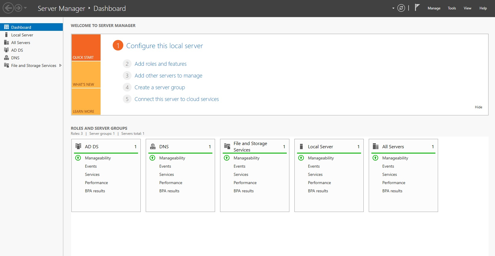
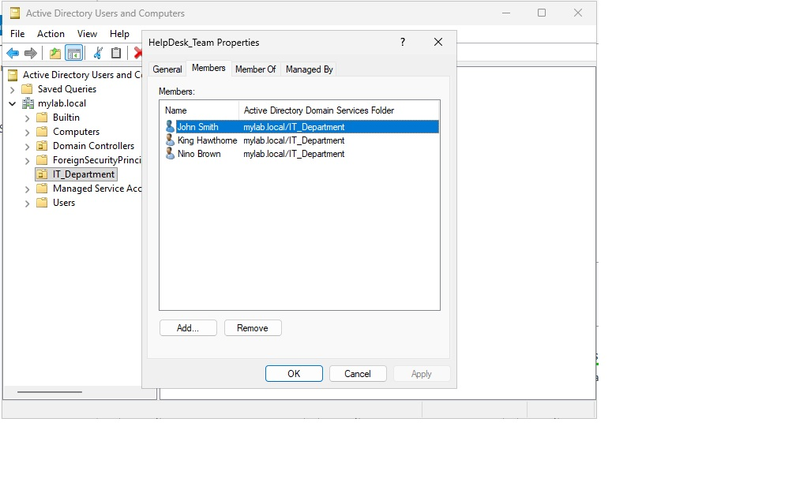
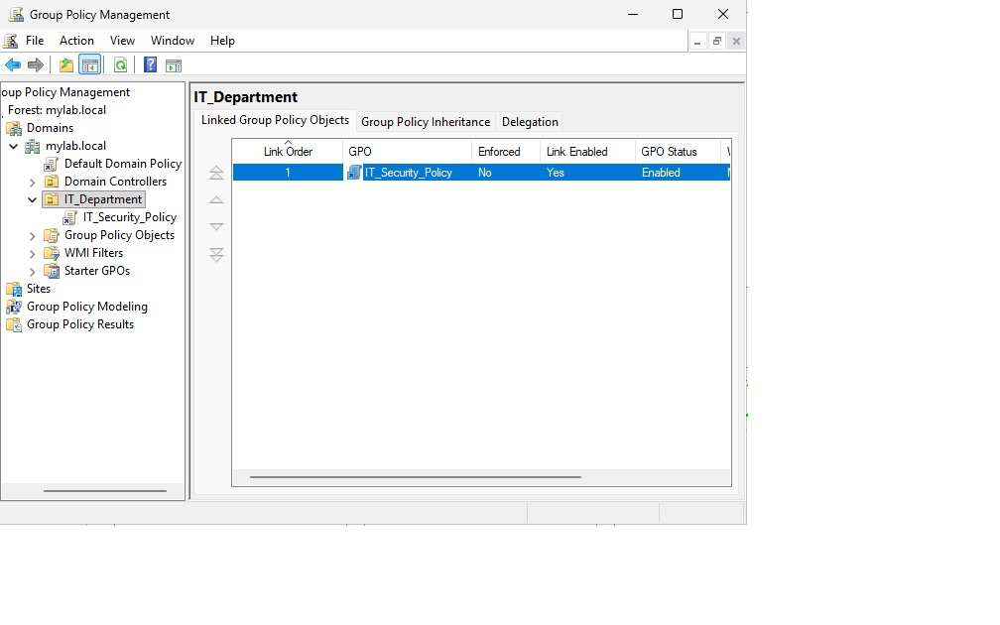
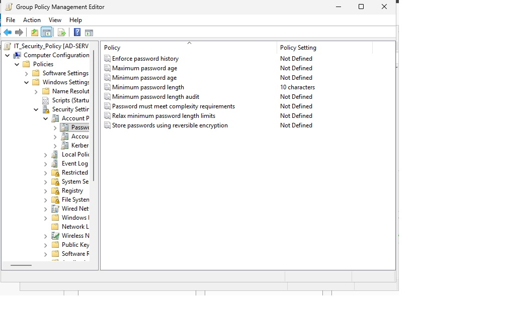

# Active Directory Home Lab — Microsoft Azure

## Overview
Built a fully functional Active Directory environment in Microsoft Azure 
to simulate real enterprise IT infrastructure. This lab demonstrates 
hands-on skills relevant to Help Desk and Cybersecurity roles.

## Tools & Technologies
- Microsoft Azure (Cloud Infrastructure)
- Windows Server 2025 Datacenter
- Active Directory Domain Services (AD DS)
- Group Policy Management
- Microsoft Remote Desktop (Windows App)

## What I Built

### 1. Cloud Infrastructure
Deployed a Windows Server 2025 virtual machine in Microsoft Azure 
(East US 2 region) using a Standard_D2als_v6 instance. Configured 
inbound RDP access and connected remotely from macOS.

### 2. Active Directory Domain Services
- Installed the AD DS role via Server Manager
- Promoted the server to a Domain Controller
- Created a new forest with the domain: mylab.local

### 3. Organizational Structure
Created an Organizational Unit (OU) called IT_Department to simulate 
a real company department structure.

### 4. User & Group Management
- Created multiple user accounts (John Smith, King Hawthorne, Nino Brown)
- Created a Security Group: HelpDesk_Team
- Assigned all users to the HelpDesk_Team group
- Verified group membership via Active Directory Users and Computers

### 5. Group Policy (GPO)
- Created a GPO named IT_Security_Policy
- Linked it to the IT_Department OU
- Configured Password Policy: minimum password length of 10 characters
- Simulates real enterprise security enforcement

## Screenshots

### Azure Portal — VM Running in Cloud

### Server Manager — AD DS and DNS Roles Installed

### HelpDesk Team — All Users Assigned to Group

### Group Policy Management — IT Security Policy Linked

### Password Policy — Minimum 10 Characters Enforced

## Skills Demonstrated
- Cloud VM deployment and configuration (Azure)
- Active Directory installation and domain setup
- User, group, and OU management
- Group Policy creation and enforcement
- Remote server administration from macOS

## How This Translates to the Real World

**Resume Bullet Point:**
"Deployed and configured a Windows Server 2025 Active Directory 
environment in Microsoft Azure. Managed users, security groups, and 
Organizational Units. Enforced enterprise security standards using 
Group Policy Objects (GPOs)."
